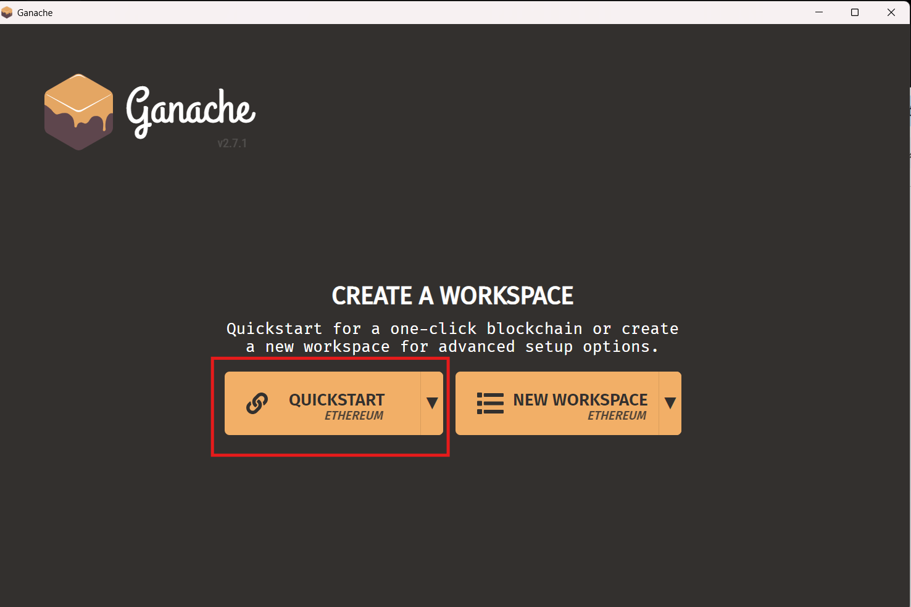
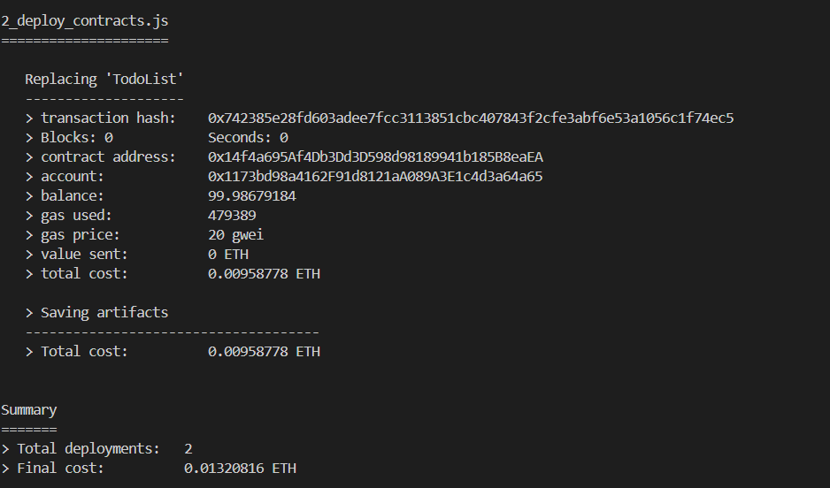
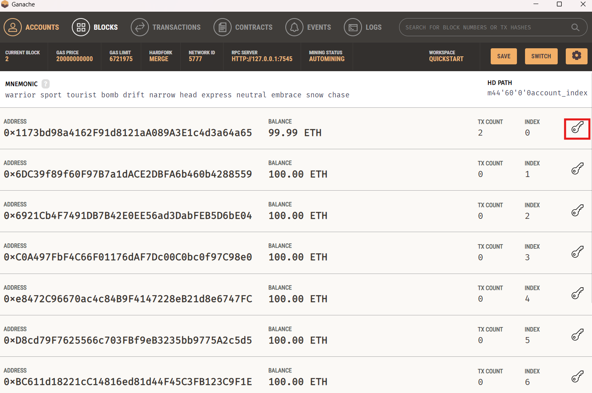
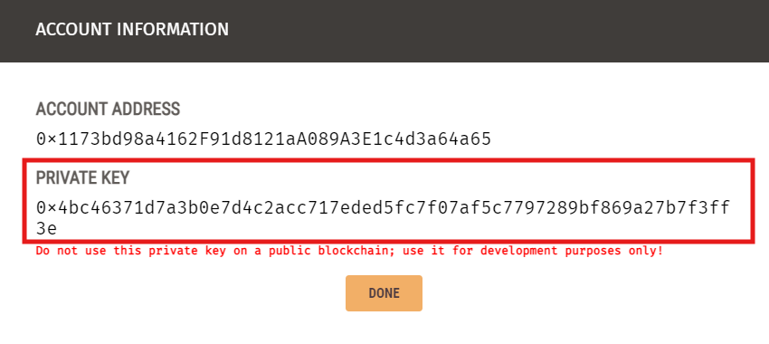
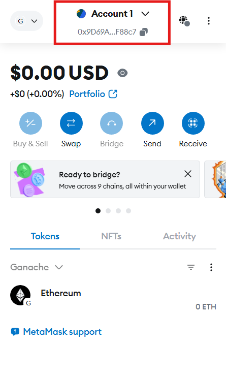
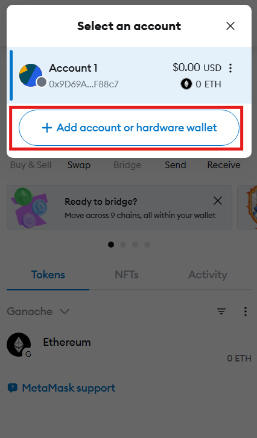
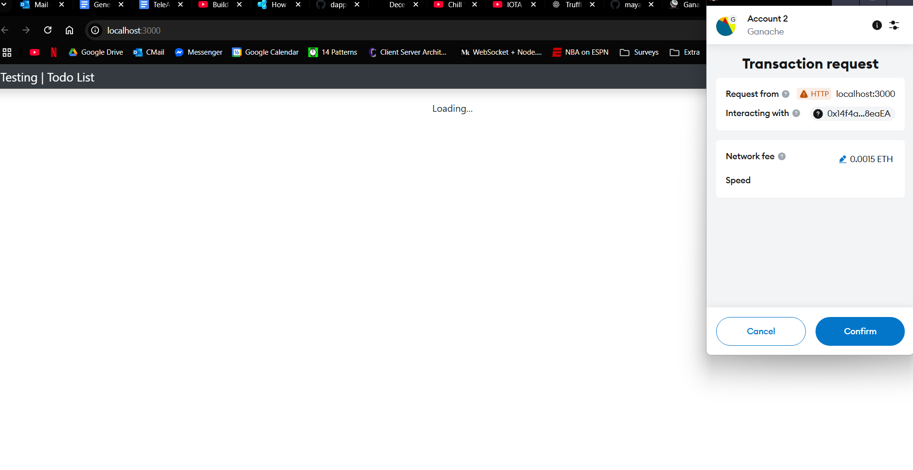

# ETH_TodoList
An application to help learn and experiment with blockchain technologies.

**Ganache Demo Application**

Demo followed: [https://www.youtube.com/watch?v=coQ5dg8wM2o&t=5312s](https://www.youtube.com/watch?v=coQ5dg8wM2o&t=5312s)

What This Demo Achieves

* Allows for a todo list application to be created using Ethereum blockchain.
* This eliminates the need for a web server backend and relies on the client interacting with the blockchain to make changes to the todo list. 
* The user may view the tasks, add to them, and check them off the list as part of the todo list operations. 

**Technologies used **

**Node.js**

Node.js is a JavaScript runtime built on Chrome’s V8 engine.

* Used to serve the front-end HTML and JavaScript files.
* Acts as a lightweight backend server.
* Handles communication between the client-side application and the Ethereum blockchain using libraries like web3.js.
* Enables asynchronous and event-driven programming for efficient blockchain interactions.

**HTML**

HTML (HyperText Markup Language) was used to build the structure of the web-based user interface.

* Provides input fields, buttons, and containers to display task data.
* Serves as the foundation of the user interface in this decentralized application (dApp).
* Combined with JavaScript and Node.js for interactivity. \

**Ethereum**

Ethereum is an open-source blockchain platform that supports smart contracts.

* Used as the decentralized network to store and verify tasks.
* Allows smart contracts to execute logic in a trustless, distributed environment.
* The project used a local Ethereum instance for development before considering deployment to a testnet or mainnet. \

**Solidity**

Solidity is a high-level, contract-oriented programming language used to write smart contracts on the Ethereum platform.

* Smart contracts were written in Solidity to define task-related operations such as creating and marking tasks.
* Provides the structure and logic for how data is stored, modified, and retrieved from the blockchain.
* Enables the creation of decentralized logic for the to-do list application.

**Ganache**

Ganache is a personal blockchain emulator for Ethereum used in development and testing.

* Provides a local environment with pre-funded accounts for running and testing contracts.
* Offers a visual interface (Ganache GUI) or command-line tool (Ganache CLI) for tracking transactions, contract deployment, and logs.
* Enables rapid iteration and debugging without the need to use real Ether. \

**Truffle**

Truffle is a development framework for building and testing Ethereum smart contracts.

* Provides tools to compile, deploy, and test smart contracts efficiently.
* Includes a migration system to manage deployments across different environments.
* Integrates with testing frameworks like Mocha and Chai for writing and running unit tests on smart contracts.
* Works in tandem with Ganache for seamless local testing.

**How to get the application running**

Prerequisites

* Install Node.js 
    * [https://nodejs.org/en/download](https://nodejs.org/en/download) 
    * Verify Node installation by running command: node -v
* Install Truffle CLI tools
    * Open a terminal (Powershell, cmd)
    * Run command: npm install -g truffle@5.0.2
    * Note: Command be for that exact version as newer versions will not work with the code for this example
* Download and Install Ganache
    * [https://archive.trufflesuite.com/ganache/](https://archive.trufflesuite.com/ganache/)
    * Open the executable file and follow the basic installation instructions
* Configure metamask
    * The example was only tested on Google Chrome, I suggest using it. 
    * Add the Metamask browser extension from: [https://metamask.io/download](https://metamask.io/download)
    * Ensure that the extension is enabled from the extensions 
    * Follow the account setup from metamask as instructed by the prompts on the metamask extension
        * You will need to create an account. 

App Setup
1. Clone the following git repository at a desired location: [https://github.com/mayankagrawal24/ETH_TodoList/tree/main](https://github.com/mayankagrawal24/ETH_TodoList/tree/main)
    * Use the command git clone &lt;Insert above URL>
2. Navigate into the root folder of the git repository
    * cd ETH_TodoList
3. Initialize and download the node modules required to run the application
    * npm install
4. Start Ganache desktop application by running the executable file for Ganache
5. Select the Quickstart option in Ganache to start the Ethereum simulator (Note if the ganache application is closed then the environment will be terminated and you will lose any data on the blockchain)

6. Run the following commands in the terminal from the ETH_TodoList directory
    * truffle compile
    * truffle migrate
        * After this command you should see roughly the following response

* At this point your smart contract has been deployed to the blockchain and it is ready to be interacted with
7. Gather the private key for the first account in the ganache editor. 
 1. Open the ganache program
 2. Click on the Key icon on the right side of the screen for the first account in list, to show the keys for the account

3. Copy the private key as it will be used in step 8 (yours will be different that this one).

8. Go to your browser and perform the following steps to add your Ganache user account to meta mask to interact with the blockchain.
 1. Click on the Metamask icon in the browser extension menu. 
 2. Click on dropdown button at the top of the metamask popup.

 

 3. Click on the “Add account or hardware wallet” button

4. Click on the private key button
5. Paste in the private key that you copied in step 7c to the input box and click import. 
6. At this point you have configured your meta mask to hold the wallet address for the first account in your Ganache environment
9. Run the Nodejs front end application
    * In the directory ETH_TodoList, run the command npm run dev
    * The frontend application should launch in your browser 
    * At this point you should see a single task called “Check ou”
    * To add a task: enter the text into the text box, then press enter. 
    * You will see a metamask popup that will ask you to confirm the transaction, press yes
    * After the new list will be loaded and you will see the new item added to it. 
    * To check off a task from the list click on the input box next to the item. You will be prompted to confirm the transaction, and the task should be checked off the list

To run the test scripts

* Run the command: truffle test
* This will invoke the file test/TodoList.test.js to run. Here you can see a few test cases that were written to test the Smart contract. 

Concluding notes

* To gain a better understanding of how the code is working please experiment with the code further.

**Blockchain Basics**

 \
**Blockchain Technologies**

High Level Blockchain Theory

Notes are based on this Video: [https://www.youtube.com/watch?v=93E_GzvpMA0&t=600s](https://www.youtube.com/watch?v=93E_GzvpMA0&t=600s)

Core Premise:

Blockchain technology enables trusted, transparent transactions without the need for a centralized third party (e.g., a bank or clearinghouse). It achieves this through a decentralized network that verifies and records transactions in a secure and immutable manner.

Key Principles

Open Ledger

* Every participant in the network has access to the full list of transactions. 
* This transparency ensures trust, as all parties can independently verify transaction history.

Distributed Ledger

* The ledger is not stored in a single, centralized location.
* Instead, every node (participant) in the network holds a complete copy of the ledger.
* This decentralization enhances security and fault tolerance, making it nearly impossible for a single point of failure or tampering to compromise the system.

Miners (or Validators)

* Miners are participants who compete to validate unconfirmed transactions.
* The first miner to successfully validate a transaction is rewarded (typically in cryptocurrency) for their computational effort.

Transaction Validation

* The miner verifies that the sender has sufficient funds to complete the transaction.
* Once verified, the miner works to generate a cryptographic key (or solve a cryptographic puzzle) that securely fits the new transaction into their copy of the blockchain.

Consensus and Broadcasting

* Once a transaction is validated and added to the miner’s copy of the ledger, it is broadcast to the entire network.
* All nodes then update their local ledgers to include the new transaction, ensuring consistency across the network.

Smart Contracts

Notes based on this Video: [https://www.youtube.com/watch?v=ZE2HxTmxfrI](https://www.youtube.com/watch?v=ZE2HxTmxfrI)

* Are immutable pieces of code that are stored on the blockchain which allow for the automatic execution of code when certain conditions are met. 
    * Once a contract is executed, the contract is irreversible and trackable.  
* Provide the removal of third party when executing agreements
* Pros:
    * Efficient and automated
    * Reduces execution time human errors 
    * Programs are immutable
* Cons:
    * Code needs to bed correct and error free otherwise there is a major security threat
    * Transactions are not reversible
    * Heavy trust on the code and programmer to ensure that the contract is correct, safe, and secure.

